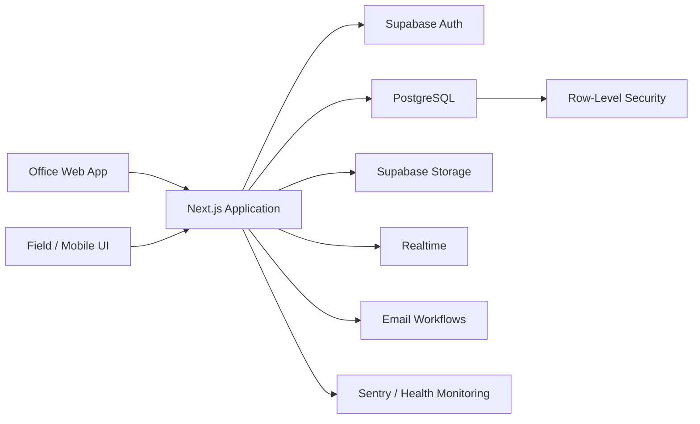

# Construction Management Platform

A production-oriented full-stack application for managing construction projects, budgets, expenses, quotes, schedules, and role-based field workflows.

> **Public showcase:** The full production repository remains private because the application is actively used by a real business. This repository contains architecture documentation plus carefully sanitized code extracts that demonstrate the engineering without exposing customer data, secrets, or internal business details.

## What I built

I designed and developed the application end-to-end, from the PostgreSQL data model and authorization rules to the responsive web interface, automated tests, CI, deployment workflow, and operational monitoring.

The platform is designed around two main user groups:

- **Office users** manage projects, budgets, quotes, vendors, schedules, and reporting.
- **Field users** work from mobile devices and record project activity with access restricted to the projects assigned to them.

## Core features

- Multi-project budget and expense tracking
- Quote and proposal workflows
- Project scheduling and task dependencies
- Vendor and subcontractor management
- Role-based authentication and authorization
- File and receipt storage
- Real-time application updates
- Hebrew RTL interface optimized for desktop and mobile use
- Versioned database migrations and auditable data changes

## Tech stack

| Area | Technologies |
|---|---|
| Frontend | Next.js, React, TypeScript, Tailwind CSS |
| Backend / Data | Supabase, PostgreSQL, Auth, Storage, Realtime |
| Authorization | PostgreSQL Row-Level Security (RLS) |
| Testing | Vitest, Playwright, pgTAP |
| CI / Delivery | GitHub Actions, Netlify, Supabase CLI |
| Containerization | Docker |
| Observability | Sentry, health/readiness endpoint |
| Email | Resend |

## Architecture

## Selected public code samples

These are sanitized extracts from the private application, chosen to show different layers of the system:

- [`examples/database/rls-policies.sql`](examples/database/rls-policies.sql) - PostgreSQL Row-Level Security with role and project-membership checks
- [`examples/backend/projects.ts`](examples/backend/projects.ts) - typed Supabase data access and derived project-budget reads
- [`examples/testing/project-expenses-browse.spec.ts`](examples/testing/project-expenses-browse.spec.ts) - Playwright coverage for pagination, search, URL state and race-condition edge cases
- [`examples/devops/Dockerfile`](examples/devops/Dockerfile) - multi-stage Next.js standalone container running as a non-root user
- [`examples/devops/ci.yml`](examples/devops/ci.yml) - CI structure for type checking, unit tests, local Supabase database tests and Playwright

The extracts are intentionally small enough to review quickly. Production-specific values, business identifiers, secrets and customer data are not included.

## Engineering highlights

### Database-first authorization

Access control is enforced in PostgreSQL using Row-Level Security rather than relying only on UI checks. Policies scope users by role and project membership, so unauthorized rows are rejected at the data layer.

### Production-oriented testing

The application uses multiple test layers:

- **Vitest** for application and unit-level behavior
- **pgTAP** for database functions, policies, and migrations
- **Playwright** for end-to-end browser flows

GitHub Actions runs automated checks on pull requests, with database tests used as a CI gate.

### Safe schema evolution

Database changes are stored as versioned migrations. Production deployment is migration-aware so application code is not released against an outdated schema. I also documented an expand/contract migration strategy and rollback procedure for risky changes.

### Reproducible deployment

The app includes a multi-stage Docker build for reproducible local and CI builds. The production deployment remains on Netlify, with automated database migration checks before the application build.

### Operational visibility

Sentry integration and a dedicated health endpoint make application failures visible outside the user interface and allow external uptime monitoring.

## Selected technical challenges

- Designing a data model that keeps project financial data consistent across budgets, actual expenses, quotes, and change history
- Enforcing different permissions for office and field users without duplicating security logic throughout the frontend
- Keeping schema migrations, generated TypeScript database types, CI, and production deployment synchronized
- Building a responsive RTL interface that remains usable on phones in field conditions
- Adding testing and deployment safeguards to a project that evolved from an MVP into a real internal product

## Screenshots

Screenshots in this public repository use demo or anonymized data only.

## Repository scope

This showcase contains selected sanitized source extracts, but intentionally does **not** publish the complete production application. It excludes:

- Customer, supplier, employee, or project data
- Environment variables, API keys, tokens, and production configuration
- Internal business documentation and operational details
- The full application source tree

## Author

**Yair Nachum**  
Computer Engineering, Bar-Ilan University  
GitHub: [yairnachum](https://github.com/yairnachum)
