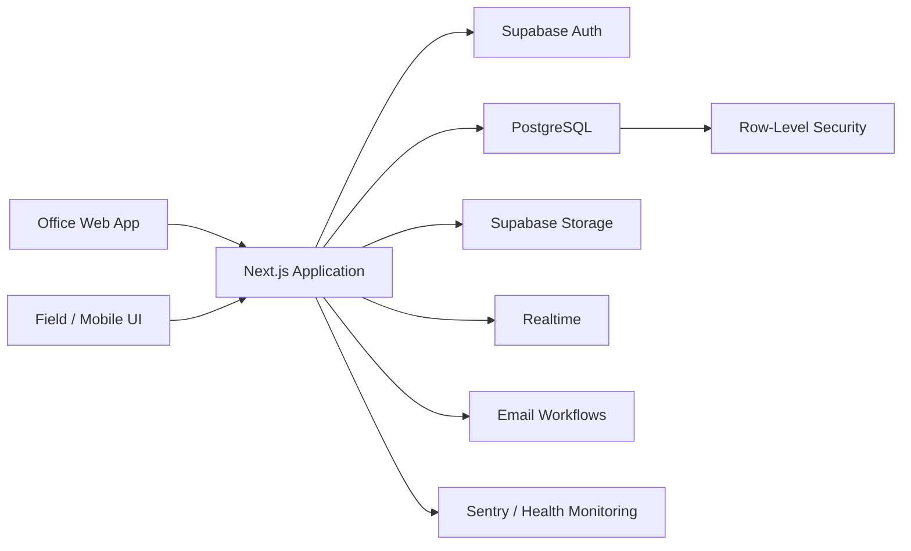

# Construction Management Platform

A production-oriented full-stack application for managing construction projects, budgets, expenses, quotes, schedules, and role-based field workflows.

> **Public showcase:** The production source code is private because the application is actively used by a real business. This repository documents the architecture, engineering decisions, and selected implementation details without exposing business data or secrets.

## What I built

I designed and developed the application end-to-end, from the PostgreSQL data model and authorization rules to the responsive web interface, automated tests, CI, deployment workflow, and operational monitoring.

The platform is designed around two main user groups:

- **Office users** manage projects, budgets, quotes, vendors, schedules, and reporting.
- **Field users** work from mobile devices and record project activity with access restricted to the projects assigned to them.

## Core features

- Multi-project budget and expense tracking
- Quote and proposal workflows
- Project scheduling and task dependencies
- Vendor and subcontractor management
- Role-based authentication and authorization
- File and receipt storage
- Real-time application updates
- Hebrew RTL interface optimized for desktop and mobile use
- Versioned database migrations and auditable data changes

## Tech stack

| Area | Technologies |
|---|---|
| Frontend | Next.js, React, TypeScript, Tailwind CSS |
| Backend / Data | Supabase, PostgreSQL, Auth, Storage, Realtime |
| Authorization | PostgreSQL Row-Level Security (RLS) |
| Testing | Vitest, Playwright, pgTAP |
| CI / Delivery | GitHub Actions, Netlify, Supabase CLI |
| Containerization | Docker |
| Observability | Sentry, health/readiness endpoint |
| Email | Resend |

## Architecture

## Engineering highlights

### Database-first authorization

Access control is enforced in PostgreSQL using Row-Level Security rather than relying only on UI checks. Policies scope users by role and project membership, so unauthorized rows are rejected at the data layer.

### Production-oriented testing

The application uses multiple test layers:

- **Vitest** for application and unit-level behavior
- **pgTAP** for database functions, policies, and migrations
- **Playwright** for end-to-end browser flows

GitHub Actions runs automated checks on pull requests, with database tests used as a blocking CI signal.

### Safe schema evolution

Database changes are stored as versioned migrations. Production deployment is migration-aware so application code is not released against an outdated schema. I also documented an expand/contract migration strategy and rollback procedure for risky changes.

### Reproducible deployment

The app includes a multi-stage Docker build for reproducible local and CI builds. The production deployment remains on Netlify, with automated database migration checks before the application build.

### Operational visibility

Sentry integration and a dedicated health endpoint make application failures visible outside the user interface and allow external uptime monitoring.

## Selected technical challenges

- Designing a data model that keeps project financial data consistent across budgets, actual expenses, quotes, and change history
- Enforcing different permissions for office and field users without duplicating security logic throughout the frontend
- Keeping schema migrations, generated TypeScript database types, CI, and production deployment synchronized
- Building a responsive RTL interface that remains usable on phones in field conditions
- Adding testing and deployment safeguards to a project that evolved from an MVP into a real internal product

## Screenshots

Screenshots in this public repository use demo or anonymized data only.

<!-- Add 3-5 screenshots here: dashboard, project budget, schedule, mobile field view, quote workflow. -->

## Repository scope

This repository intentionally does **not** contain:

- Production source code
- Customer or project data
- Environment variables or API keys
- Internal operational documentation

It exists as a technical portfolio of the system I designed and built.

## Author

**Yair Nachum**  
Computer Engineering, Bar-Ilan University  
GitHub: [yairnachum](https://github.com/yairnachum)
